# Architecture

## 1. Trusted pull-request inputs

On a PR, Hedge loads these from the **base SHA** through the GitHub API:

- `.hedge.yml`
- `.hedge/context.yml`
- `threatmodel.json` for integrity-checked lifecycle state
- bounded PR patches

The exact base and head source bytes are read from Git objects without checkout, filters, hooks, or target execution. The checked-out PR head supplies the object database only. A contributor cannot weaken the failure threshold, expand token budgets, erase the baseline, or replace reviewed context in their own review.

## 2. Repository collector

The collector reads bounded source text and prioritizes routes, middleware, auth, data models, storage, dependencies, workflows, and infrastructure-relevant files. It ignores generated output and configured paths.

## 3. AST and metadata extractors

Handler-scoped TypeScript AST analysis extracts supported Next.js routes, exported Server Actions, and Express entry points. It resolves inline handlers, named handlers, aliases, route groups, dynamic/catch-all paths, custom router receivers, same-file helpers, and supported middleware. Next.js matchers and Express middleware path/order are applied conservatively. Within each callable surface it records controls and capabilities rather than assuming that a check elsewhere in the file protects the route.

Additional metadata extractors cover GitHub Action/workflow YAML, package dependencies, and Prisma models.

## 4. Reviewed context

`.hedge/context.yml` records five facts source code cannot reliably infer:

1. Sensitive assets.
2. Internet-facing components.
3. Authentication mechanisms.
4. Privileged roles.
5. Trusted external services.

Missing answers remain explicit unknowns.

## 5. Evidence graph

Nodes represent entry points, controls, databases, storage, models, services, secrets, dependencies, and privileged components. Edges represent calls, reads, writes, authentication, authorization, trust-boundary crossings, secret use, and dependencies. Every extracted claim carries source provenance and confidence.

## 6. Graph delta

Normalized graphs are compared while ignoring timestamps. The delta is the product primitive:

```text
code before → code after
attack surface before → attack surface after
```

No meaningful graph delta means no model call and no new comment. It is a confirmed no-delta result only when both revisions are exact and supported coverage is complete; otherwise the run records degraded/failed health without claiming safety.

## 7. Explicit security invariants

Trusted `.hedge.yml` configuration can define repository commitments such as “public upload routes require authentication and a size limit.” Hedge evaluates those invariants against changed graph nodes before model reasoning and records `satisfied`, `violated`, `not-applicable`, or `unknown` with exact evidence.

## 8. Observation, inference, and decision layers

Hedge does not collapse the analysis into one model-authored verdict:

1. **Observations** are deterministic graph-delta facts with evidence.
2. **Inferences** are risk hypotheses linked to observations, assumptions, confidence, and origin.
3. **Decisions** record whether the run is allowed, warned, or blocked and identify the threshold, invariant, policy, or human action responsible.

The GitHub Action fails from the recorded decision, not from free-form model text.
Model-origin findings remain reviewable inferences but cannot directly create a blocking decision.

## 9. GPT-5.6 router

- Luna performs inexpensive scope triage.
- Sol receives only the bounded graph delta, reviewed assumptions/unknowns, evidence index, and patch data.
- Repository content is wrapped as untrusted data.
- Responses must satisfy strict schemas.
- Evidence references are resolved against the deterministic index. A model proposal with no valid evidence is omitted.
- Reported usage combines triage and deep-analysis tokens.

## 10. Register and report

`threatmodel.json` holds the graph, next risk number, findings, lifecycle state, verification history, and accepted-risk audit trail. PR reports are idempotent and include a hidden machine-readable payload for the authorized Codex command workflow.

## 11. Credential-separated PR pipeline

The installed workflow uses three artifact-bound jobs:

1. **Collect:** read-only GitHub authority, exact base/head extraction, deterministic analysis, coverage/health recording, and RunManifest creation in a runner-owned temporary directory; no OpenAI key or target execution.
2. **Reason:** no target checkout and no GitHub write authority; validates the immutable collection manifest before Luna/Sol or deterministic fallback and emits only a strict reason bundle plus its manifest into a separate temporary directory.
3. **Publish:** no OpenAI credential; independently downloads the original collection and reason artifacts, validates schemas, byte limits, SHA-256 digests, exact repository/PR/workflow/Action bindings, and the freshly re-fetched PR head before rendering one idempotent report.

Confirmed no-delta skips the reasoning job entirely and removes a stale Hedge report. Partial or unsupported no-change observations remain silent but do not erase prior complete output.

## 12. Remediation split

The `@hedge fix HEDGE-NNN` example uses four authority-separated jobs:

1. **Authorize:** strict command parsing, write-permission check, same-repository PR check, trusted Hedge-report extraction.
2. **Remediate:** read-only GitHub permissions, non-persisted checkout credentials, `openai/codex-action@v1`, workspace-write sandbox, and no push.
3. **Validate:** no OpenAI credential or write authority, rejects unsafe/bounded patch forms, applies the patch, and runs target validation in a constrained later job.
4. **Publish:** no OpenAI credential, rechecks the authorized head and validated digest, creates a dedicated branch, and opens exactly one draft PR.

## 13. Verification

A separate workflow receives no OpenAI credential. It requires:

- Witness succeeds on the vulnerable revision.
- The same witness is blocked on the repaired revision.
- Legitimate behavior still succeeds.
- A subsequent graph comparison confirms the relevant control/path changed.

Only complete evidence moves a risk to `verified`.

## Trust-boundary overview

```mermaid
flowchart LR
  PR[Untrusted PR source and metadata] --> READ[Bounded evidence reader]
  BASE[Trusted base policy, context, register] --> READ
  READ --> AST[Deterministic AST and metadata extraction]
  AST --> DIFF[Security architecture delta]
  DIFF --> INV[Explicit invariant evaluation]
  INV --> OBS[Deterministic observations]
  OBS --> MODEL[GPT-5.6 structured interpretation]
  KEY[OpenAI credential] --> MODEL
  MODEL --> VALIDATE[Schema and evidence validation]
  VALIDATE --> DECIDE[Inference and policy decision]
  DECIDE --> REPORT[Idempotent PR report]
  REPORT --> APPROVE[Maintainer command]
  APPROVE --> CODEX[Isolated Codex remediation]
  CODEX --> PATCH[Binary patch artifact]
  PATCH --> DRAFT[Secretless draft-PR publisher]
  DRAFT --> VERIFY[Secretless counterfactual verification]
  VERIFY --> STATE[Reviewable model-refresh PR]
```



## v0.5 structural layer

Explicit invariants are now separate from general custom policies and are persisted in the latest trusted state. Analysis output separates deterministic observations, security inferences, and merge decisions. The Action exports the final `allow`, `warn`, or `block` decision and uses that decision as the failure authority.

`hedge replay` executes the complete local pipeline from versioned `base/` and `head/` trees, optionally using schema-validated recorded model boundaries. Replays assert expected architecture change, decision, findings, observation types, and invariant states while generating the same Markdown, HTML, SARIF, delta, and analysis artifacts as a normal run.

See `docs/REPLAY.md`.

## v0.4 evidence, integrity, and artifact layer

Hedge emits one evidence set through multiple compatible surfaces: Markdown for review, standalone HTML for the demo, SARIF for GitHub code scanning, machine-readable delta/analysis JSON for integrations, and a proof bundle with SHA-256 artifact digests. The register stores a bounded run history so a threat model is visibly living rather than repeatedly overwritten.

Organization-specific policies are parsed from the trusted base `.hedge.yml` and run deterministically against added or changed graph nodes. They cannot be modified by a pull request to judge that same pull request.

The register is written atomically and sealed with a versioned digest covering the graph, findings, run history, verification, and accepted-risk audit trail. Legacy graph-only state remains readable for one explicit migration path and is resealed on the next successful baseline refresh. Reports carry a source-commit binding and digest so a remediation command cannot silently act on a newer PR head than the analysis it references.

Source collection exposes coverage metadata rather than implying completeness. File/byte limits, binary skips, symlink rejection, unreadable files, and unsupported dynamic matcher behavior become explicit assumptions or unknowns. Sensitive deterministic deltas force deep analysis even when inexpensive triage would otherwise decline escalation.
