# Hedge self-threat model

This document records system facts source extraction cannot fully infer. The same reviewed facts live in `.hedge/context.yml` so `hedge init` can merge them into the evidence graph.

## Primary assets

- OpenAI credential or short-lived workload identity.
- GitHub token and repository write authority.
- Integrity of the security architecture report.
- Integrity of `threatmodel.json`, risk status history, and verification evidence.
- Maintainer approval boundary for remediation.
- Verification logs and witness results.

## Trust boundaries

```mermaid
flowchart LR
  PR[Untrusted PR title, body, diff, source, comments] --> API[Secretless exact collector]
  BASE[Trusted base revision config, context, register] --> API
  API --> GRAPH[Deterministic base/head graph extractor]
  GRAPH --> MANIFEST[RunManifest-bound artifacts]
  MANIFEST --> MODEL[No-checkout GPT-5.6 structured analysis]
  KEY[OpenAI credential] --> MODEL
  MODEL --> VALIDATE[Schema and evidence validation]
  VALIDATE --> PUB[No-key stale-head publisher]
  PUB --> COMMENT[GitHub report]
  COMMENT --> APPROVE[Authorized maintainer command]
  APPROVE --> CODEX[Isolated Codex repair job]
  CODEX --> PATCH[Binary patch artifact]
  PATCH --> PUBLISH[Separate publisher job]
  PUBLISH --> DRAFT[Draft repair PR]
  DRAFT --> VERIFY[Secretless counterfactual verification]
  VERIFY --> STATE[Reviewed threat-model state]
```

## HEDGE-SELF-001 — Prompt injection through repository content

**Risk:** A malicious pull request embeds instructions intended to suppress findings, change the review objective, reveal credentials, manipulate tool use, or cause unsafe output.

**Attack path:** Untrusted PR content → model context → analysis or downstream action.

**Implemented controls:**

- Repository and PR content is explicitly marked as untrusted data.
- System instructions state that repository text cannot alter the analysis objective.
- The analysis model receives no shell, GitHub-write, secret-reading, or arbitrary network tools.
- Model output must conform to a strict schema.
- Evidence references are resolved against the deterministic graph; unsupported model findings are omitted.
- Model text is never interpolated directly into a shell command.
- Adversarial fixtures confirm instruction-like strings remain data in the deterministic path.

**Residual risk:** Delimiters and prompting do not prove immunity. The frozen boundary probe held in three runs, but broader API-backed adversarial evaluation remains required.

**Status:** Controls implemented; one frozen repeated boundary probe passed, while the overall live operational gate failed.

## HEDGE-SELF-002 — Secret exfiltration from a pull-request workflow

**Risk:** A pull request changes local Action code, model configuration, baseline state, or target code and causes it to execute in a job holding the OpenAI credential or write-capable GitHub token.

**Implemented controls:**

- `.hedge.yml`, `.hedge/context.yml`, and `threatmodel.json` are loaded from the trusted base commit through the GitHub API.
- Absence or invalidity of trusted register state triggers an exact base-graph rebuild; Hedge never compares with an empty graph or falls back to PR-head state.
- PR patch evidence is fetched through the GitHub API and bounded by trusted base configuration.
- The competition workflow is restricted to same-repository pull requests.
- The secret-bearing reasoning job has no target checkout, target execution, or GitHub write authority.
- Collection and publication have no OpenAI credential. RunManifest v0.1 binds every handoff to exact revisions, trusted inputs, exact workflow/Action commits, runtime schemas, coverage/health state, and artifact bytes.
- Stage files are created exclusively below `runner.temp`. The publisher independently downloads the immutable collector artifact, so the model-bearing reasoning job cannot replace its evidence and recompute a self-consistent manifest.
- Verification has no OpenAI credential or repository-write token.
- Remediation transfers a binary patch from the Codex job to a separate publisher job.

**Residual risk:** The live canary covers one same-repository path. Immutable final release pinning, fork-safe operation, and production workload identity remain open.

**Status:** Hackathon architecture implemented, contract-tested, and proven through one credential-separated live canary.

## HEDGE-SELF-003 — False verification

**Risk:** A contributor adds a meaningless test or weak mitigation and Hedge closes the risk.

**Implemented controls:**

- Finding lifecycle is `open → mitigation-detected → verification-available → verified`.
- Test-file existence cannot produce `verified`.
- The witness must reproduce the behavior on the vulnerable revision.
- The same witness must be blocked on the repaired revision.
- Legitimate behavior must continue to pass.
- A relevant architecture/control change must be recorded.
- Commands, revisions, actor, notes, and artifacts are stored as verification evidence.
- The demo repository contains executable vulnerable/repaired/legitimate witnesses.

**Residual risk:** Arbitrary repositories may need project-specific witness adapters and human review of the claimed invariant.

**Status:** Lifecycle, CLI, workflow example, and executable demo are implemented; one live remote finding passed all four requirements and was recorded as verified.

## HEDGE-SELF-004 — Model-driven command injection

**Risk:** Model output or repository text crosses into shell execution.

**Implemented controls:**

- Analysis returns structured findings rather than raw commands.
- Local CLI remediation uses repository-owned allowlisted command plans.
- GitHub remediation requires a strict `@hedge fix HEDGE-NNN` command from an actor with write permission.
- The Codex job is isolated and creates only a binary patch artifact.
- A separate no-OpenAI-key publisher job applies the patch and opens a draft PR.
- No direct push to the protected default branch is permitted.

**Residual risk:** Codex may still create an incorrect patch; maintainer review and counterfactual verification remain mandatory.

**Status:** Live Codex patch production succeeded. Automated target validation did not complete, so publication and verification remain experimental.

## HEDGE-SELF-005 — State poisoning

**Risk:** A pull request edits Hedge configuration, context, or register to hide its own security delta, lower severity, or accept findings.

**Implemented controls:**

- PR analysis loads all policy and baseline state from the base SHA.
- Model input uses bounded GitHub API patch evidence rather than trusting a checked-out head state.
- Risk acceptance requires an explicit actor, timestamp, and non-empty reason.
- Generated-state refresh is proposed through a reviewable pull request.
- Atomic writes prevent interrupted local refreshes from leaving partial JSON.
- A versioned digest covers the graph, findings, run history, verification, and accepted-risk records.
- Any full-register digest failure invalidates the entire register, including lifecycle, acceptance, verification, IDs, and graph.
- Machine-readable remediation payloads are bound to the exact analyzed PR head and a payload digest.

**Residual risk:** The digest is tamper-evident but not externally signed; a fully compromised trusted base branch can replace both state and digest.

**Status:** Base-state isolation, source binding, complete-register integrity, atomic writes, and legacy migration are implemented; external signing remains future hardening.
